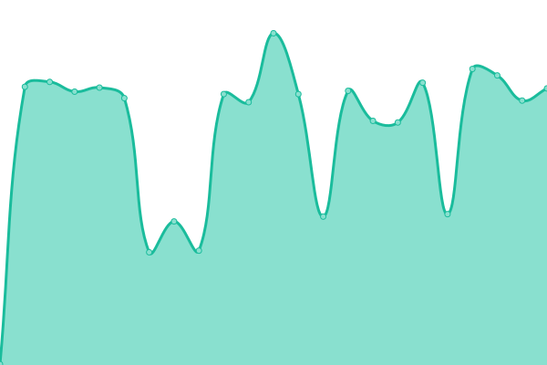
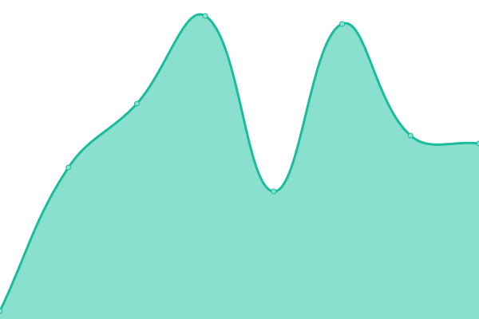

# [📈 Live Status](https://juan9f.github.io/mpsa-uptime): <!--live status--> **🟧 Partial outage**

This repository contains the open-source uptime monitor and status page for [juan9f](https://juan9f.github.io/mpsa-uptime), powered by [Upptime](https://github.com/upptime/upptime).

With [Upptime](https://upptime.js.org), you can get your own unlimited and free uptime monitor and status page, powered entirely by a GitHub repository. We use [Issues](https://github.com/juan9f/mpsa-uptime/issues) as incident reports, [Actions](https://github.com/juan9f/mpsa-uptime/actions) as uptime monitors, and [Pages](https://juan9f.github.io/mpsa-uptime) for the status page.

<!--start: status pages-->
<!-- This summary is generated by Upptime (https://github.com/upptime/upptime) -->
<!-- Do not edit this manually, your changes will be overwritten -->
<!-- prettier-ignore -->
| URL | Status | History | Response Time | Uptime |
| --- | ------ | ------- | ------------- | ------ |
|  [Itris](190.210.205.89) | 🟩 Up | [itris.yml](https://github.com/juan9f/mpsa-uptime/commits/HEAD/history/itris.yml) | 

 186ms
     
 | 

<a href="https://juan9f.github.io/mpsa-uptime/history/itris">99.68%</a>
    

|  [GV](http://rh03.rhconsult.com.ar/) | 🟩 Up | [gv.yml](https://github.com/juan9f/mpsa-uptime/commits/HEAD/history/gv.yml) | 

 716ms
     
 | 

<a href="https://juan9f.github.io/mpsa-uptime/history/gv">100.00%</a>
    

|  [Campus Manpetrol FSE](https://campus.manpetrolfse.com.ar/) | 🟩 Up | [campus-manpetrol-fse.yml](https://github.com/juan9f/mpsa-uptime/commits/HEAD/history/campus-manpetrol-fse.yml) | 

 786ms
     
 | 

<a href="https://juan9f.github.io/mpsa-uptime/history/campus-manpetrol-fse">98.01%</a>
    

|  [PDM (Success Factors)](https://performancemanager5.successfactors.eu/login#/login) | 🟩 Up | [pdm-success-factors.yml](https://github.com/juan9f/mpsa-uptime/commits/HEAD/history/pdm-success-factors.yml) | 

 679ms
     
 | 

<a href="https://juan9f.github.io/mpsa-uptime/history/pdm-success-factors">100.00%</a>
    

|  [Tu Legajo](https://app.tulegajo.com/login.htm) | 🟩 Up | [tu-legajo.yml](https://github.com/juan9f/mpsa-uptime/commits/HEAD/history/tu-legajo.yml) | 

 267ms
     
 | 

<a href="https://juan9f.github.io/mpsa-uptime/history/tu-legajo">100.00%</a>
    

|  [Portal Empleo](https://manpetrol.hiringroom.com/jobs/) | 🟩 Up | [portal-empleo.yml](https://github.com/juan9f/mpsa-uptime/commits/HEAD/history/portal-empleo.yml) | 

 327ms
     
 | 

<a href="https://juan9f.github.io/mpsa-uptime/history/portal-empleo">100.00%</a>
    

|  [Web Mail Manpetrol](https://www.office.com/) | 🟩 Up | [web-mail-manpetrol.yml](https://github.com/juan9f/mpsa-uptime/commits/HEAD/history/web-mail-manpetrol.yml) | 

 113ms
     
 | 

<a href="https://juan9f.github.io/mpsa-uptime/history/web-mail-manpetrol">100.00%</a>
    

|  [Web Mail Field Services](https://www.office.com/) | 🟩 Up | [web-mail-field-services.yml](https://github.com/juan9f/mpsa-uptime/commits/HEAD/history/web-mail-field-services.yml) | 

 49ms
     
 | 

<a href="https://juan9f.github.io/mpsa-uptime/history/web-mail-field-services">100.00%</a>
    

|  [PAE (SAP Contratistas)](https://agp.pan-energy.com/irj/portal) | 🟩 Up | [pae-sap-contratistas.yml](https://github.com/juan9f/mpsa-uptime/commits/HEAD/history/pae-sap-contratistas.yml) | 

 983ms
     
 | 

<a href="https://juan9f.github.io/mpsa-uptime/history/pae-sap-contratistas">100.00%</a>
    

|  [Patagon - Internet](200.70.31.131) | 🟥 Down | [patagon-internet.yml](https://github.com/juan9f/mpsa-uptime/commits/HEAD/history/patagon-internet.yml) | 

 0ms
     
 | 

<a href="https://juan9f.github.io/mpsa-uptime/history/patagon-internet">100.00%</a>
    

|  [Esparta - Internet](200.24.255.240) | 🟩 Up | [esparta-internet.yml](https://github.com/juan9f/mpsa-uptime/commits/HEAD/history/esparta-internet.yml) | 

 223ms
     
 | 

<a href="https://juan9f.github.io/mpsa-uptime/history/esparta-internet">100.00%</a>
    

<!--end: status pages-->

[**Visit our status website →**](https://juan9f.github.io/mpsa-uptime)

## 📄 License

- Powered by: [Upptime](https://github.com/upptime/upptime)
- Code: [MIT](./LICENSE) © [juan9f](https://juan9f.github.io/mpsa-uptime)
- Data in the `./history` directory: [Open Database License](https://opendatacommons.org/licenses/odbl/1-0/)
